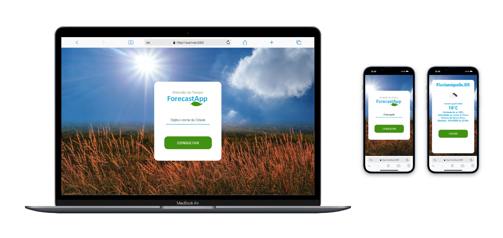

# ⚡ Projeto
## ⛅ Bem-vindo ao projeto ForecastApp! 
### Este é um app de Previsão do tempo desenvolvido em React JS. 
## Pré-requisitos

Antes de começar, certifique-se de ter o Node.js e o npm instalados em seu ambiente de desenvolvimento.

- Node.js: [Baixar Node.js](https://nodejs.org/)
- npm (gerenciador de pacotes do Node.js): Geralmente instalado junto com o Node.js

## Instalação

1. Clone este repositório para o seu ambiente local:

   ```bash
   git clone https://github.com/seu-usuario/forecastapp.git
   
2. Navegue até o diretório do projeto:

   ```bash
   cd api-app
      
3. Instale as dependências necessárias do projeto utilizando npm:

   ```bash
   npm install
      
4. Se necessário, execute o comando a seguir para corrigir vulnerabilidades:

   ```bash
   npm audit fix --force (se for necessário)

5. Instale as seguintes dependências adicionais:
   ```bash
   npm install axios

   npm install react-router-dom
   
   npm install react-spinner --save

   npm install react-lottie --save

6. Para iniciar o servidor de desenvolvimento do Angular e visualizar o projeto:

   ```bash
   npm start

